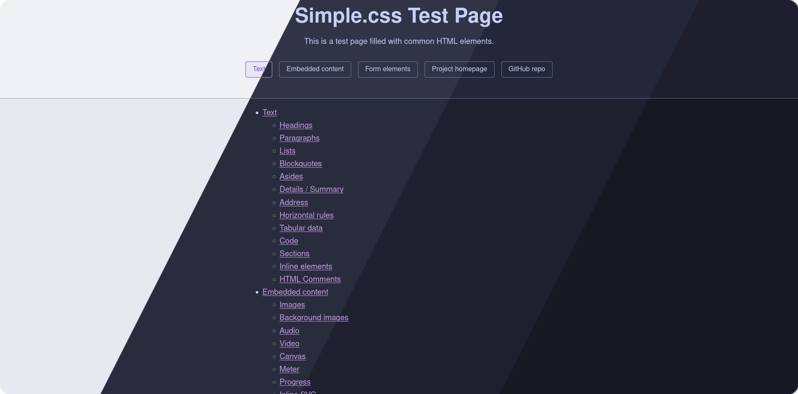
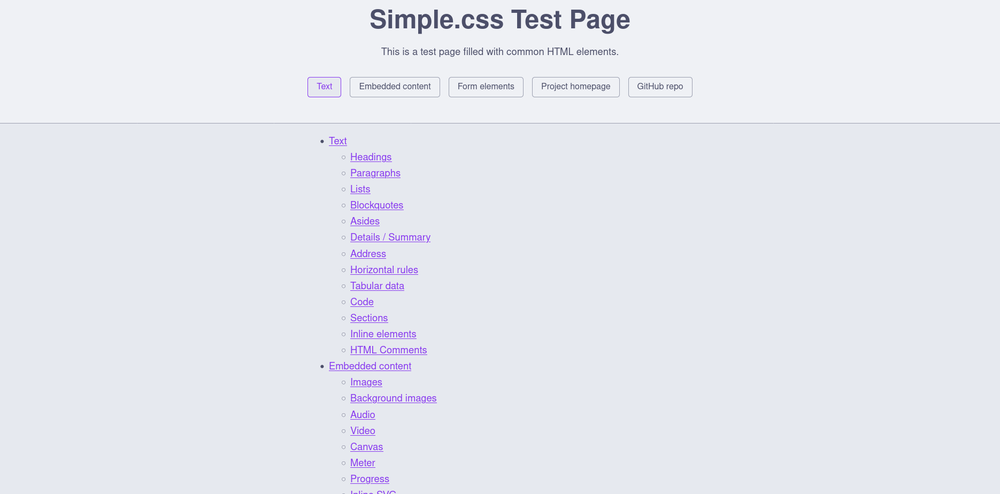
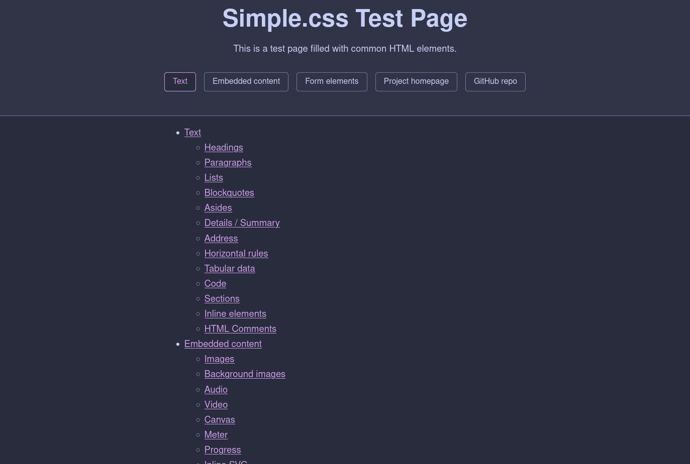
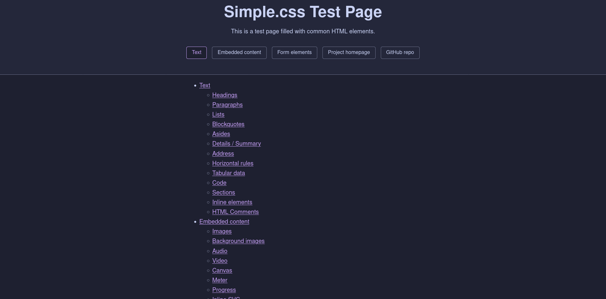
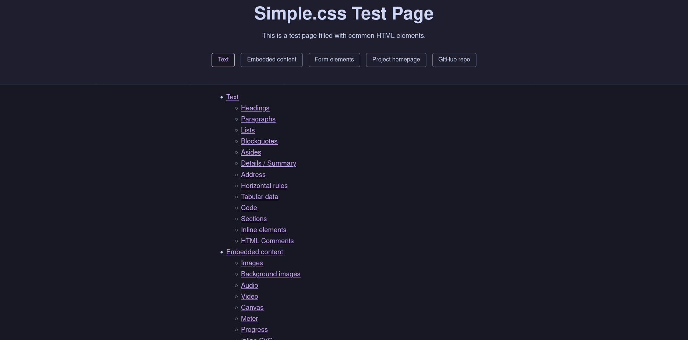

<h3 align="center">
	 
	
	Catppuccin for <a href="https://github.com/kevquirk/simple.css">Simple.css</a>
	
</h3>

	
	
	

	

## Previews

🌻 Latte

🪴 Frappé

🌺 Macchiato

🌿 Mocha

## Usage

### Method 1 (Recommended)

1. Add `<link rel="stylesheet" href="https://cdn.jsdelivr.net/gh/scarcekoi/simple.css@main/themes/<flavor>/catppuccin-<flavor>-<accent>.css">` (replace `<flavor>` and `<accent>` with your flavor and accent of choice) to the `head` in your HTML file.
2. Enjoy!

### Method 2

1. Download the CSS file of your flavor and accent combination of choice from [themes](themes).
2. Place it inside of your project directory.
3. Add `<link rel="stylesheet" href="/path/to/catppuccin-<flavor>-<accent>.css">` (replace `<flavor>` and `<accent>` with your flavor and accent of choice.) to the `head` in your HTML file.
4. Enjoy!

## 💝 Thanks to

- [Scarce Koi](https://github.com/scarcekoi)

&nbsp;

	

	Copyright &copy; 2021-present <a href="https://github.com/catppuccin" target="_blank">Catppuccin Org</a>

	

